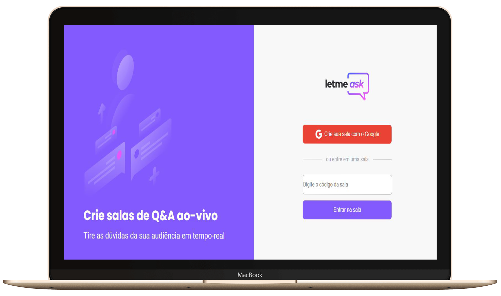

<h1 align="center">
    
</h1>

<h4 align="center">
  🚀 Next Level Week 6.0 by RocketSeat
</h4>

  
  

  

## 👨🏼‍💻 Projeto

O <b>Letmeask</b> é um aplicação que tem intuito de servir como um gerenciador e ranqueador de perguntas que pode ser utilizado por pessoas que estão fazendo live ou apresentações via internet.</b>.

## 🔨 Tecnologias

- [JavaScript](https://developer.mozilla.org/pt-BR/docs/Aprender/JavaScript)
- [ReactJs](https://pt-br.reactjs.org/)
- [Firebase](https://www.mongodb.com/)

## 🔄 Executar

- Fazer clone do repositório;

### 💻 Front-end

- Entrar na pasta `frontend`;
- Executar `yarn install` para instalar dependências do projeto;
- Executar `yarn start` para que o projeto seja executado;

## 🌐 Disponível em

Link: https://letmeask-b84b0.web.app/

## ♻️ Como contribuir

- Faça um fork desse repositório;
- Crie uma branch com a sua feature: `git checkout -b minha-feature`
- Commit suas mudanças: `git commit -m ':emoji: feat: My new feature'`
- Push a sua branch: `git push origin my-feature`

## 📝 Licença

Este projeto está sobre a licença MIT. Veja o arquivo [LICENSE](LICENSE.md) para mais detalhes.

---

<h4 align="center">
  Feito com ❤️ by Gustavo Souza
</h4>
